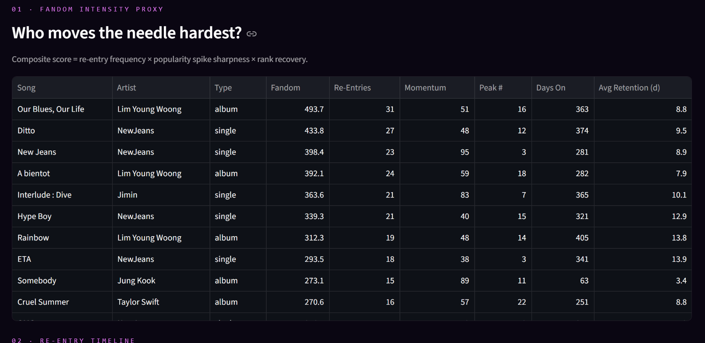
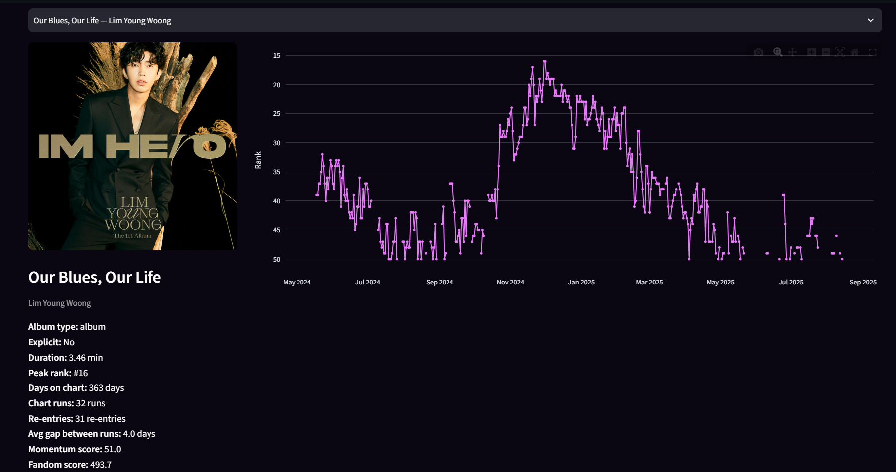
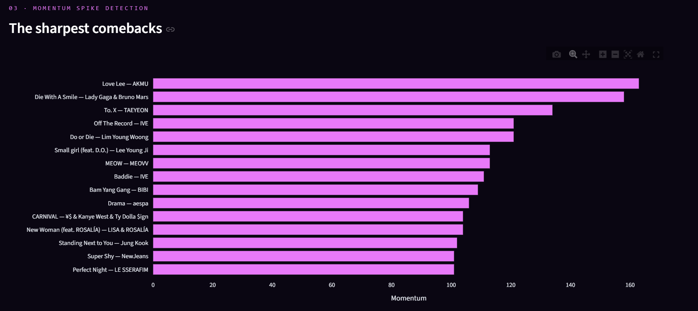
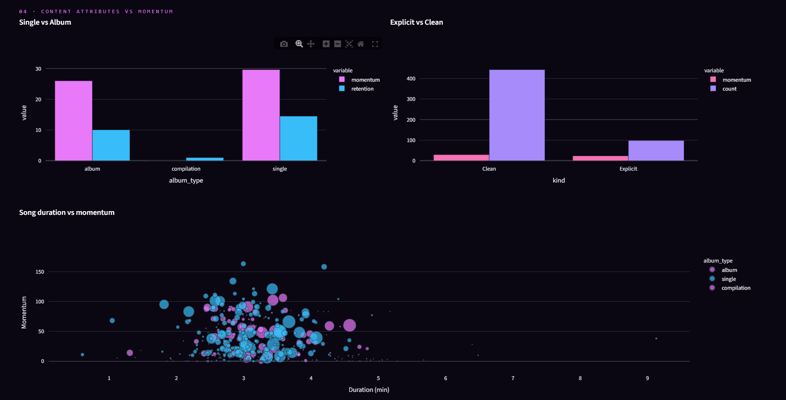
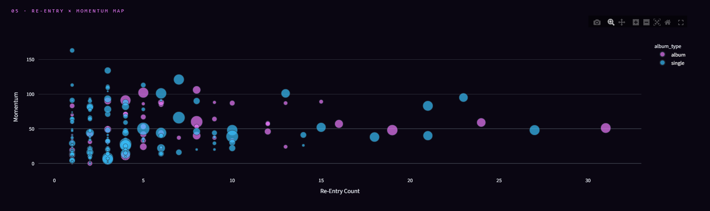
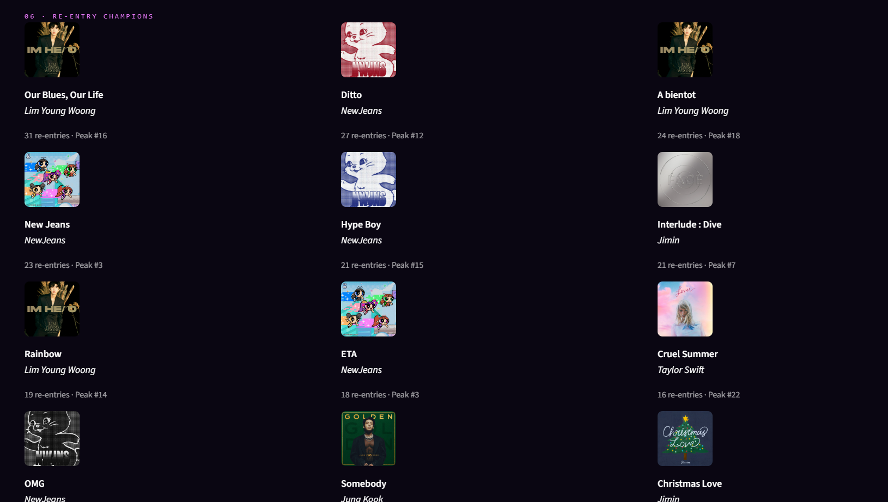
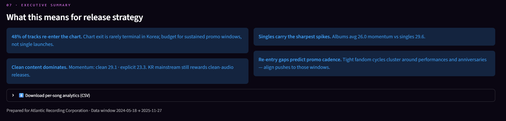

# K-Pulse — South Korea Top 50 Playlist Analytics

## Project Overview

**K-Pulse** is an interactive Streamlit dashboard for analyzing the **South Korea Top 50 Playlist** (Atlantic Recording Corp.) — focusing on **comeback momentum**, **chart re-entry patterns**, and **fandom intensity** metrics.

This project transforms daily chart-tracking data into actionable intelligence for release strategy, promo cadence planning, and fandom engagement analysis.

---

## Problem Statement

K-Pop chart dynamics in South Korea exhibit unique patterns:
- Tracks frequently **re-enter** the chart after exiting (comebacks, anniversaries, viral moments)
- **Album cuts** often outperform singles in comeback intensity
- **Clean-content** tracks dominate mainstream momentum
- **Fandom-driven** re-entry cycles cluster around performances, anniversaries, and variety show appearances

Traditional chart analytics miss these nuances. K-Pulse quantifies them.

---

## Project Architecture

```
K-Pulse/
├── dashboard/
│   ├── __init__.py
│   └── app.py              
├── data/
│   └── Atlantic_South_Korea.csv 
├── docs/
│   └──screenshots/
│      └── 01_fandom_leaderboard.png
│      └── 02_timeline.png
│       └── 03_momentum.png
│      └── 04_attributes.png
│      └── 05_map.png
│      └── 06_champions.png
│      └── 07_summary.png
│
├── main.py       ---------> Entry point of the project            
├── README.md
├── requirements.txt
└── .gitignore
```

---

## Dataset Description

**Source:** `data/Atlantic_South_Korea.csv`  
**Period:** Daily snapshots from 2024-05-18 onwards  
**Granularity:** One row per track per chart date

| Column | Type | Description |
|--------|------|-------------|
| `date` | string (DD-MM-YYYY) | Chart reporting date |
| `position` | int | Chart rank (1–50) |
| `song` | string | Track title |
| `artist` | string | Artist name |
| `popularity` | int (0–100) | Spotify popularity score |
| `duration_ms` | int | Track duration in milliseconds |
| `album_type` | string | `single` or `album` |
| `total_tracks` | int | Tracks on parent album |
| `is_explicit` | bool | Explicit content flag |
| `album_cover_url` | string | Spotify album art URL |

> **Key:** A track is uniquely identified by `song + artist` (normalized as `key = "Song — Artist"`).

---

## Key Metrics & Methodology

### Core Metrics Computed Per Track

| Metric | Formula / Logic | Interpretation |
|--------|-----------------|----------------|
| **Days on Chart** | Count of unique dates track appears | Total chart longevity |
| **Peak Rank** | `min(position)` | Highest chart position achieved |
| **Avg Popularity** | `mean(popularity)` | Baseline streaming traction |
| **Peak Popularity** | `max(popularity)` | Maximum viral/streaming moment |
| **Chart Runs** | Contiguous date sequences (gap >1 day = new run) | Number of distinct chart appearances |
| **Re-entries** | `runs - 1` | Number of comebacks after exit |
| **Momentum Score** | `max( (first_rank - best_rank)×2 + (peak_pop - first_pop) )` across runs | Sharpest rank recovery + popularity spike |
| **Avg Retention (days)** | Mean days from peak rank to run end | How long momentum sustains post-peak |
| **Avg Gap (days)** | Mean days between consecutive runs | Fandom promo cycle cadence |
| **Fandom Score** | `reentries×15 + momentum×0.5 + (peak_pop - avg_pop)×0.8` | Composite fandom intensity proxy |

### Run Detection Logic
- Tracks are sorted by date per `key`
- A **gap > 1 day** between consecutive dates splits a run
- This captures true "exits" vs. weekend-only charting

---

## Dashboard Modules

### 1 · Fandom Intensity Leaderboard
- Ranked table of all tracks by **Fandom Score**
- Columns: Song, Artist, Album Type, Fandom, Re-Entries, Momentum, Peak Rank, Days On, Avg Retention
- Filterable by album type, explicit flag, min re-entries, search

### 2 · Re-Entry Timeline (Per Track)
- Interactive rank-over-time chart with **visual breaks at chart exits**
- Sidebar track selector with album art, metadata, and all computed metrics
- Hover for exact date + rank

### 3 · Momentum Spike Detection
- Horizontal bar chart: Top 15 tracks by **Momentum Score**
- Identifies sharpest comebacks (rank recovery + popularity surge)

### 4 · Content Attributes vs Momentum
| Panel | Insight |
|-------|---------|
| **Single vs Album** | Grouped bar: mean momentum & retention by album type |
| **Explicit vs Clean** | Grouped bar: mean momentum & track count |
| **Duration vs Momentum** | Scatter: song duration (min) vs momentum, sized by days on chart, colored by album type |

### 5 · Re-Entry × Momentum Map
- Scatter: X = Re-entry count, Y = Momentum, Size = Days on Chart, Color = Album Type
- Quadrant analysis: high-re-entry + high-momentum = fandom-driven comebacks

### 6 · Re-Entry Champions
- Top 12 tracks with ≥1 re-entry, displayed as cards with cover art
- Quick visual identification of "comeback kings"

### 7 · Executive Summary
- Auto-generated strategic takeaways:
  - % of catalog that re-enters
  - Album vs single momentum comparison
  - Explicit vs clean momentum comparison
  - Re-entry gap patterns → promo cadence recommendations

### Export
- **Download per-song analytics CSV** (all computed metrics, excludes run bounds)

---

## Forecasting / ML Components

> **Note:** This project focuses on **descriptive analytics & pattern detection** rather than predictive forecasting. The metrics (momentum, fandom score, re-entry cycles) are designed for *strategic planning* — not time-series prediction.

Future enhancement ideas:
- Prophet/ARIMA forecasting of next re-entry window per track
- Classification: predict if a new entry will re-enter within 30 days
- Clustering: group tracks by re-entry pattern archetypes

---

## Data Validation

The pipeline performs basic integrity checks on load:

| Check | Logic |
|-------|-------|
| Date parsing | `dayfirst=True`, coerce errors → drops invalid rows |
| Explicit flag | Normalized to boolean (`TRUE`/`FALSE` case-insensitive) |
| Duration | Converted to minutes for readability |
| Key construction | `song.strip() + " — " + artist.strip()` |
| Sorting | By `key` then `date` for run detection |

---

## Installation

- Clone Repository

  ```bash
  git clone https://github.com/Dhritiman-M/Analysis_of_South_KoreaTop50_Playlist.git
  cd Analysis of South KoreaTop 50 Playlists
  ```

- Install Dependencies

  ```bash
  pip install -r requirements.txt
  ```
- Launch Dashboard
  ```bash
  streamlit run dashboard/streamlit_app.py
  (or)
  python main.py
  ```
---

## Dashboard Preview

| Module | Screenshot Placeholder |
|--------|------------------------|
| Fandom Leaderboard |  |
| Re-Entry Timeline |  |
| Momentum Spikes |  |
| Content Attributes |  |
| Re-Entry × Momentum Map |  |
| Re-Entry Champions |  |
| Executive Summary |  |


---

## Interpreting Results for Strategy

| Finding | Strategic Implication |
|---------|----------------------|
| **>50% of tracks re-enter** | Chart exit ≠ campaign end; budget for sustained promo windows |
| **Album cuts > Singles on momentum** | Prioritize album-track push for comebacks; singles for launch |
| **Clean > Explicit momentum** | KR mainstream rewards clean edits; invest in radio-friendly versions |
| **Tight re-entry gaps (7–14 days)** | Align promo pushes to music show cycles, variety appearances, anniversaries |
| **High fandom score + low peak rank** | Cult fandom driving longevity; nurture community channels |

---

## Project Context

**Client / Stakeholder:** Atlantic Recording Corporation  
**Focus Market:** South Korea (Melon / Circle / Spotify KR Top 50)  
**Use Case:** Release strategy optimization, fandom engagement measurement, promo calendar planning

---

## Future Enhancements

- Predictive re-entry model (Prophet / survival analysis)
- Artist-level aggregation (catalog-wide fandom health)
- External signal integration (YouTube views, TikTok trends, music show wins)
- Automated alerting on momentum spikes / re-entry detection
- Multi-market comparison (KR vs JP vs US charts)
- Export to Notion / Slack for stakeholder sharing

---

For inquiries or assistance, reach out to the project contributors:

- Author : Dhritiman Modak
- GitHub: [github.com/Dhritiman-M](https://github.com/Dhritiman-M)
- Email: dhritimanmodak72@gmail.com
- Project By Unified Mentor

---
## APP LIVE AT - https://playlists-analysis.streamlit.app/

## ⭐ If you found this project useful, consider giving it a star!
